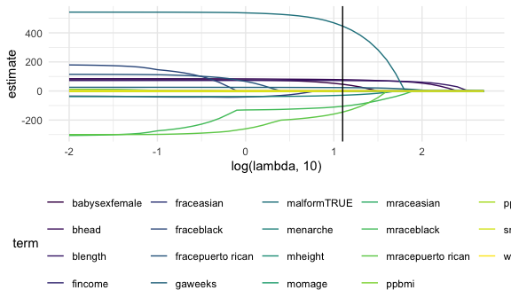
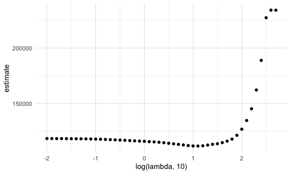

stat_learning
================
ruby
2025-11-20

``` r
library(tidyverse)
library(glmnet)
library(palmerpenguins)

knitr::opts_chunk$set(
  fig.width = 6,
  fig.asp = .6,
  out.width = "90%"
)

theme_set(theme_minimal() + theme(legend.position = "bottom"))

options(
  ggplot2.continuous.colour = "viridis",
  ggplot2.continuous.fill = "viridis"
)

scale_colour_discrete = scale_colour_viridis_d
scale_fill_discrete = scale_fill_viridis_d

set.seed(11)
```

supervised learning

- there is an outcome that you are predicting
- regression, lasso/elastic net, regression trees, support vector
  machines

unsupervised learning

- find patterns and identify subgroups, no outcome really
- clustering, principal components, factor analysis

generally would prefer to use lasso over step wise regression for model
building

### do LASSO (least absolute shrinkage and selection operator)

``` r
bwt_df = 
  read_csv("extra_topic_data/birthweight.csv") |> 
  janitor::clean_names() |>
  mutate(
    babysex = 
        case_match(babysex,
            1 ~ "male",
            2 ~ "female"
        ),
    babysex = fct_infreq(babysex),
    frace = 
        case_match(frace,
            1 ~ "white",
            2 ~ "black", 
            3 ~ "asian", 
            4 ~ "puerto rican", 
            8 ~ "other"),
    frace = fct_infreq(frace),
    mrace = 
        case_match(mrace,
            1 ~ "white",
            2 ~ "black", 
            3 ~ "asian", 
            4 ~ "puerto rican",
            8 ~ "other"),
    mrace = fct_infreq(mrace),
    malform = as.logical(malform)) |> 
  sample_n(200)
```

    ## Rows: 4342 Columns: 20
    ## ── Column specification ────────────────────────────────────────────────────────
    ## Delimiter: ","
    ## dbl (20): babysex, bhead, blength, bwt, delwt, fincome, frace, gaweeks, malf...
    ## 
    ## ℹ Use `spec()` to retrieve the full column specification for this data.
    ## ℹ Specify the column types or set `show_col_types = FALSE` to quiet this message.

need to do some data processing. a design matrix

``` r
x = model.matrix(bwt ~ ., bwt_df)[, -1]
y = bwt_df |> pull(bwt)
```

define some lambdas and fit Lasso for each

``` r
lambda = 10^(seq(-2, 2.75, 0.1))

lasso_fit = 
  glmnet(x = x, y = y, lambda = lambda)

lasso_cv = 
  cv.glmnet(x = x, y = y, lambda = lambda)

lambda_opt = lasso_cv[["lambda.min"]]
```

there’s a lot of stuff in these.

Here’s plot 1:

``` r
lasso_fit |> 
  broom::tidy() |> 
  select(term, lambda, estimate) |> 
  complete(term, lambda, fill = list(estimate = 0)) |> 
  filter(term != "(Intercept)") |> 
  ggplot(aes(x = log(lambda, 10), y = estimate, group = term, color = term)) +
  geom_line() +
  geom_vline(xintercept = log(lambda_opt, 10))
```



Here’s plot 2: estimate here is the estimate of the root mean error

``` r
lasso_cv |> 
  broom::tidy() |> 
  ggplot(aes( x = log(lambda, 10), y = estimate)) + 
  geom_point()
```


